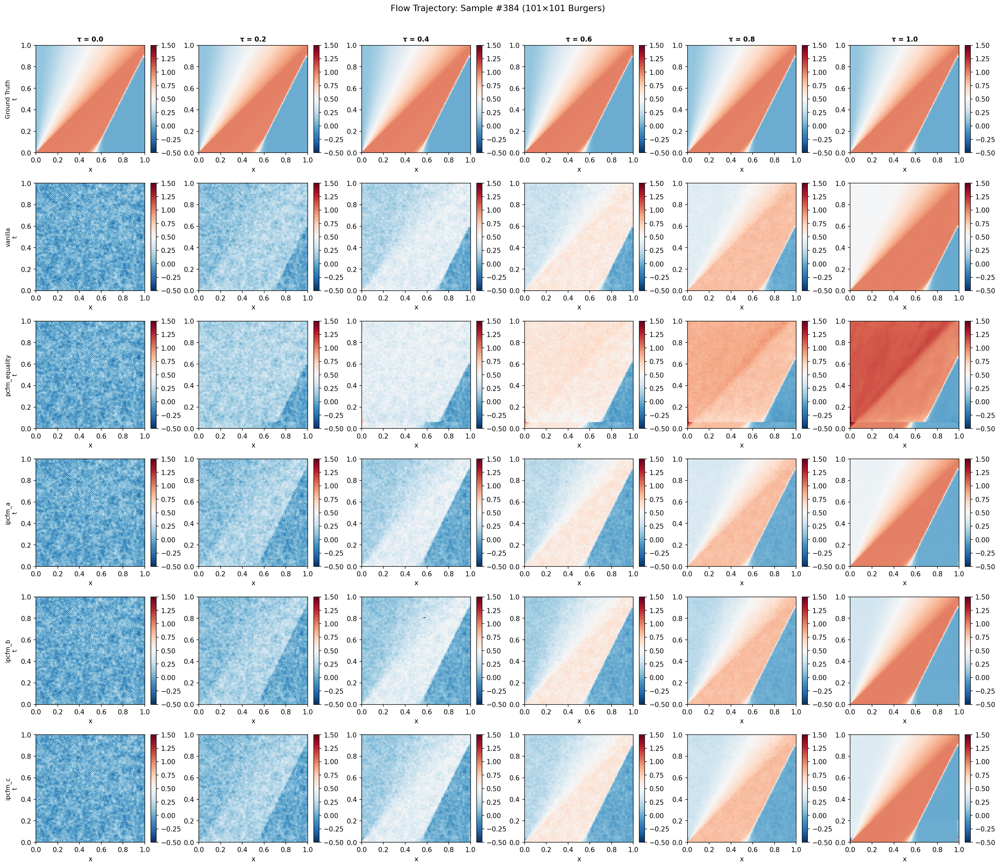

# I-PCFM: Inequality-Constrained Physics Flow Matching

> Course project for **NUS CS6282, Spring 2026**.

This repository contains the code for **I-PCFM: Inequality-Constrained Physics Flow Matching**, which extends Physics-Constrained Flow Matching (PCFM) to jointly enforce **equality and inequality constraints** during sampling, and evaluates three strategies on the 1D inviscid Burgers equation with the Oleinik entropy condition.

---

## Overview

PCFM enforces only equality constraints $h(u) = 0$. This project adds three strategies for also enforcing inequality constraints $g(u) \le 0$ — the entropy condition for Burgers' equation in our experiments — during flow-matching sampling:

| Strategy | Method | File |
|---|---|---|
| **A** | Slack-variable reformulation | `pcfm/ipcfm_sampling.py:ipcfm_a_sample` |
| **B** | Log-barrier augmentation | `pcfm/ipcfm_sampling.py:ipcfm_b_sample` |
| **C** | Active-set projection | `pcfm/ipcfm_sampling.py:ipcfm_c_sample` |

All three re-use the PCFM Newton-projection machinery and add a numerical safety net (Tikhonov regularization + `lstsq` fallback + trust-region cap) so the projection degrades gracefully on rank-deficient systems.

---

## Main Results

**Experiment 1 — comparison of all methods** on 30 random test samples (seed 42) with `n_steps=100`:

| Method | CE(IC) ↓ | CE(CL) ↓ | CE-Ineq ↓ | Feasibility ↑ | MMSE ↓ | SMSE ↓ | s/sample |
|---|---:|---:|---:|---:|---:|---:|---:|
| Vanilla FFM | 3.334 | 0.052 | 0.190 | 0.000 | 0.0168 | 0.0048 | 0.14 |
| PCFM (equality only) | 1.1e-6 | 2.1e-3 | **2.625** | 0.000 | 0.0243 | 0.0102 | 1.89 |
| **I-PCFM-A** (slack) | 1.0e-4 | **6.7e-4** | 0.139 | 0.000 | 0.0086 | **0.0028** | 34.3 |
| **I-PCFM-B** (barrier) | 2.2e-3 | 2.1e-3 | 0.287 | 0.067 | 0.0095 | **0.0026** | 32.0 |
| **I-PCFM-C** (active-set) | 1.1e-3 | 2.5e-3 | 0.239 | **0.333** | **0.0080** | 0.0032 | **16.3** |

**Key takeaways:**
- PCFM actively *hurts* inequality satisfaction: enforcing $h=0$ pushes solutions into the entropy-violating region (CE-Ineq rises 14× over vanilla).
- All three I-PCFM variants restore inequality quality while preserving equality (CE(IC) kept at $10^{-3}$–$10^{-4}$) and roughly halving reconstruction error.
- I-PCFM-C achieves the best Pareto point: highest strict feasibility (33%), lowest MMSE, and runs 2× faster than A and B.

### Sample trajectory visualization



Each row is a method, each column a flow-time snapshot ($\tau \in \{0, 0.2, 0.4, 0.6, 0.8, 1.0\}$). All three I-PCFM variants preserve the right-propagating shock while Vanilla retains GP-prior noise texture.

The pre-generated results used in this README are stored in [`results/`](results/). The instructions below reproduce them end-to-end.

---

## Setup

### 1. Clone & create the conda environment

```bash
git clone https://github.com/alfred-leong/I-PCFM.git
cd I-PCFM

conda env create -f pcfm_env.yml -n i-pcfm
conda activate i-pcfm

# The env pin for `proplot` conflicts with matplotlib 3.9 and is not used in
# the evaluation code — if the pip step fails on proplot, ignore it, then:
pip install neuraloperator==1.0.2 gpytorch
```

Verify the install:

```bash
python -c "import torch, h5py, neuralop, gpytorch; print('torch', torch.__version__, 'cuda', torch.cuda.is_available())"
```

You should see `torch 2.4.1 cuda True` on a CUDA-capable host.

### 2. Download the dataset and pretrained checkpoint

The Burgers test/train data and the pretrained FFM checkpoint are hosted on Hugging Face:

- Dataset: [`alfred-leong/I-PCFM-burgers`](https://huggingface.co/datasets/alfred-leong/I-PCFM-burgers) — 4 `.h5` files, ~1.1 GB
- Model: [`alfred-leong/I-PCFM-ffm-burgers`](https://huggingface.co/alfred-leong/I-PCFM-ffm-burgers) — `20000.pt`, 205 MB

Download with `huggingface_hub`:

```bash
# dataset → datasets/I-PCFM_data/
mkdir -p datasets/I-PCFM_data
huggingface-cli download alfred-leong/I-PCFM-burgers \
    --repo-type dataset --local-dir datasets/I-PCFM_data

# pretrained FFM checkpoint → models/
mkdir -p models
huggingface-cli download alfred-leong/I-PCFM-ffm-burgers 20000.pt \
    --local-dir models
```

Verify:

```bash
ls -la datasets/I-PCFM_data/   # should show burgers_{test,train,sampling_diff*}.h5
ls -la models/20000.pt         # should be ~205 MB
```

### 3. Sanity check

```bash
python -c "
import torch
from models import get_flow_model
from scripts.training.utils import load_config
cfg = load_config('configs/burgers1d.yml')
model = get_flow_model(cfg.model, cfg.encoder).cuda().eval()
ckpt = torch.load('models/20000.pt', map_location='cuda', weights_only=False)
model.load_state_dict({k:v for k,v in ckpt['model'].items() if k != '_metadata'}, strict=False)
u = torch.randn(2, 101, 101, device='cuda')
v = model(torch.tensor(0.5, device='cuda'), u)
print('forward OK, out shape:', v.shape)
"
```

---

## Reproducing the Experiments

All evaluation is driven by `evaluate_ipcfm.py`. Pre-generated outputs live in [`results/`](results/); the commands below reproduce each of them end-to-end on seed-42 random sample selection.

### Generate the sample-index file (once)

```bash
python -c "
import numpy as np, json
rng = np.random.default_rng(42)
indices = sorted(rng.choice(900, size=30, replace=False).tolist())
json.dump({'good_indices': indices, 'seed': 42, 'n': 30},
          open('results/random_indices.json', 'w'), indent=2)
"
```

### Exp 1 — main comparison table

```bash
CUDA_VISIBLE_DEVICES=0 python evaluate_ipcfm.py \
    --method all --exp1_main --skip_methods soft_penalty \
    --no_wandb \
    --good_indices_file results/random_indices.json \
    --data datasets/I-PCFM_data/burgers_test_nIC30_nBC30.h5 \
    --ckpt models/20000.pt \
    --solve_eps 1e-4 --slack_threshold 0.05
```

Output: `results/exp1_main_table.json` (≈45 min on a single L40).

### Exp 2 — constraint-quality trade-off

```bash
# Sweep μ_0 for I-PCFM-B
python evaluate_ipcfm.py --method ipcfm_b --exp2_sweep mu0 \
    --no_wandb --good_indices_file results/random_indices.json \
    --data datasets/I-PCFM_data/burgers_test_nIC30_nBC30.h5 \
    --ckpt models/20000.pt --solve_eps 1e-4 --slack_threshold 0.05

# Sweep ε for I-PCFM-C
python evaluate_ipcfm.py --method ipcfm_c --exp2_sweep eps \
    --no_wandb --good_indices_file results/random_indices.json \
    --data datasets/I-PCFM_data/burgers_test_nIC30_nBC30.h5 \
    --ckpt models/20000.pt --solve_eps 1e-4 --slack_threshold 0.05
```

Output: `results/exp2_tradeoff.json` (≈2 h on a single L40).

### Exp 4 — active-set size vs flow time (I-PCFM-C)

```bash
python evaluate_ipcfm.py --method ipcfm_c --exp4_active_set \
    --no_wandb --good_indices_file results/random_indices.json \
    --data datasets/I-PCFM_data/burgers_test_nIC30_nBC30.h5 \
    --ckpt models/20000.pt --solve_eps 1e-4
```

Outputs: `results/exp4_active_set.json` and `results/exp4_active_set.png` (≈10 min).

### Visualizations

```bash
# Per-method final-sample comparison (one PNG per sample, 6 heatmaps each)
python visualize_samples.py \
    --ckpt models/20000.pt \
    --data datasets/I-PCFM_data/burgers_test_nIC30_nBC30.h5 \
    --good_indices_file results/random_indices.json \
    --out_dir results/sample_heatmaps --n_samples 10

# Full flow trajectory (6-method rows × 6-tau columns per sample)
python visualize_trajectory.py \
    --ckpt models/20000.pt \
    --data datasets/I-PCFM_data/burgers_test_nIC30_nBC30.h5 \
    --good_indices_file results/random_indices.json \
    --out_dir results/sample_heatmaps --n_samples 10
```

### Running experiments in parallel (recommended)

Exp 1, Exp 2, Exp 4 are independent. Launch each in its own screen session on a separate GPU:

```bash
screen -dmS exp1 bash -c "CUDA_VISIBLE_DEVICES=0 python evaluate_ipcfm.py --method all --exp1_main ... > results/exp1_main.log 2>&1"
screen -dmS exp2 bash -c "CUDA_VISIBLE_DEVICES=1 python evaluate_ipcfm.py --method ipcfm_b --exp2_sweep mu0 ... > results/exp2_ipcfm_b.log 2>&1; python evaluate_ipcfm.py --method ipcfm_c --exp2_sweep eps ... > results/exp2_ipcfm_c.log 2>&1"
screen -dmS exp4 bash -c "CUDA_VISIBLE_DEVICES=2 python evaluate_ipcfm.py --method ipcfm_c --exp4_active_set ... > results/exp4.log 2>&1"
```

Reattach with `screen -r exp1`, detach again with `Ctrl+A D`.

---

## Key Hyperparameters

| Flag | Default | Used by | Notes |
|---|---:|---|---|
| `--n_steps` | 100 | all | Euler integration steps |
| `--solve_eps` | `1e-4` | A, C | Tikhonov regularization on $JJ^\top$ |
| `--slack_threshold` | `0.05` | A | near-active band |
| `--mu_0` | `1e-3` | B | initial barrier coefficient |
| `--decay_rate` | `3.0` | B | barrier time decay |
| `--eps` | `1e-3` | C | active-set threshold |

Recommended safe ranges (from Exp 2): $\mu_0 \in [10^{-4}, 10^{-3}]$ for B; $\epsilon \in [10^{-4}, 10^{-2}]$ for C. Avoid $\mu_0 \ge 10^{-2}$ or $\epsilon \ge 10^{-1}$ — the method stays finite thanks to the safety guards, but the projection becomes physically meaningless.

---

## Repository Layout

```
.
├── evaluate_ipcfm.py          # main evaluation driver (Exp 1/2/3/4)
├── visualize_samples.py       # final-sample heatmap grids
├── visualize_trajectory.py    # full-flow trajectory grids
├── configs/burgers1d.yml      # FFM/FNO config
├── pcfm/
│   ├── ipcfm_sampling.py      # Strategies A, B, C
│   ├── pcfm_sampling.py       # base PCFM sampling
│   └── baselines.py           # soft_penalty baseline
├── models/
│   ├── fno.py                 # FNO wrapper (used for the vector field)
│   ├── functional.py          # FFM wrapper
│   └── 20000.pt               # pretrained checkpoint (NOT in git; see Setup)
├── datasets/I-PCFM_data/      # Burgers .h5 test/train sets (NOT in git; see Setup)
├── scripts/training/          # training entry point (if retraining from scratch)
└── results/                   # experiment outputs
```

---

## Citation

```bibtex
@article{PCFM2025,
  title={Physics-Constrained Flow Matching: Sampling Generative Models with Hard Constraints},
  author={Utkarsh, Utkarsh and Cai, Pengfei and Edelman, Alan and Gomez-Bombarelli, Rafael and Rackauckas, Christopher Vincent},
  journal={arXiv preprint arXiv:2506.04171},
  year={2025}
}
```
