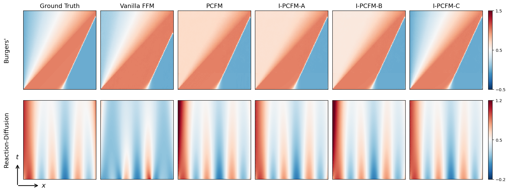

# I-PCFM: Inequality-aware Physics-Constrained Flow Matching

> **Note for reviewers.** This repository is anonymised for double-blind review. All datasets and pretrained checkpoints can be regenerated locally from the included generators and training scripts (see Setup below); no external downloads are required. Reproducing both datasets and training both FFM models takes roughly 7–8 h on a single L40-class GPU (plus ~10 min of CPU for the data generation), after which all reported experiments can be reproduced end-to-end.

This repository contains the code for **I-PCFM: Inequality-aware Physics-Constrained Flow Matching**, which extends Physics-Constrained Flow Matching (PCFM) to **jointly enforce equality and inequality constraints** during sampling, and evaluates three strategies on two 1-D PDEs: the **inviscid Burgers' equation** (with the Oleinik entropy condition) and the **Reaction-Diffusion (Fisher-KPP) equation** (with the invariant interval $u \in [0, 1]$).

---

## Overview

PCFM enforces only equality constraints $h(u) = 0$. This project adds three strategies for also enforcing inequality constraints $g(u) \le 0$ during flow-matching sampling:

| Strategy | Method | Where it acts | File |
|---|---|---|---|
| **A** | Slack-variable reformulation | Gauss–Newton projection step | `pcfm/ipcfm_sampling.py:ipcfm_a_sample` |
| **B** | Log-barrier augmentation | Relaxed constraint correction step | `pcfm/ipcfm_sampling.py:ipcfm_b_sample` |
| **C** | Active-set projection | Gauss–Newton projection step | `pcfm/ipcfm_sampling.py:ipcfm_c_sample` |

All three reuse the PCFM Newton-projection machinery and add a numerical safety net (Tikhonov regularisation + `lstsq` fallback + trust-region cap) so the projection degrades gracefully on rank-deficient systems.

**Tasks.** Both PDEs are discretised on a 2-D space–time grid:
- **Burgers' equation** $\partial_t u + \partial_x(u^2/2) = 0$ on $(x,t) \in [0,1]^2$ with a $101 \times 101$ grid.
- **Reaction-Diffusion (Fisher-KPP)** $\partial_t u = \nu\,\partial_{xx} u + \rho\,u(1-u)$ on $(x,t) \in [0,1]^2$ with a $128 \times 100$ grid.

---

## Main Results

**Comparison of all methods** on $N=100$ random test samples (seed 42) with `n_steps=100`, using symmetric $k=20$ Godunov unrolling on Burgers' for every method:

| Method | Burgers' CE-Ineq ↓ | Burgers' Feas. ↑ | RD CE-Ineq ↓ | RD Feas. ↑ |
|---|---:|---:|---:|---:|
| Vanilla FFM        | 0.149 | 0.00 | 0.082  | 0.00 |
| PCFM (equality only) | 0.750 | 0.00 | 1.628  | 0.30 |
| I-PCFM-A (slack)    | 0.209 | 0.00 | 0.008  | 0.40 |
| I-PCFM-B (barrier)  | 0.574 | 0.04 | 1.875  | 0.27 |
| **I-PCFM-C (active-set)** | 0.418 | **0.53** | **0.0005** | **0.97** |

Here *Feas.* is the **joint-feasibility rate** — the fraction of samples with both equality residual and maximum inequality violation below $10^{-3}$. Full numbers (CE-IC, CE-CL, MMSE, SMSE, wall-clock) live in [`results/exp1_main_table_n100_joint.json`](results/exp1_main_table_n100_joint.json) and [`results/exp1_rd_linear_main_table_n100_joint.json`](results/exp1_rd_linear_main_table_n100_joint.json).

**Key takeaways.**
- **PCFM alone actively *hurts* inequality satisfaction**: Enforcing only equality constraints pushes solutions out of the inequality-feasible region (CE-Ineq rises ~5× on Burgers' and 20× on RD compared to Vanilla).
- **I-PCFM-C achieves the best feasibility on both tasks**: Active-set projection achieves highest joint feasibility while being the fastest I-PCFM variant

### Visual comparison



*One Burgers' (top) and one Reaction-Diffusion (bottom) test sample, one column per method. On Burgers', all methods reproduce the diagonal shock and the differences between methods are small for this particular sample. On Reaction-Diffusion, Vanilla FFM shows noisy structure and PCFM / I-PCFM-B produce bright red patches where values exceed 1; I-PCFM-C removes these patches and best recovers the band pattern of the Ground Truth.*

Per-sample flow-trajectory snapshots at $\tau \in \{0, 0.2, 0.4, 0.6, 0.8, 1.0\}$ are in [`results/sample_heatmaps_k20/`](results/sample_heatmaps_k20) (Burgers', symmetric $k=20$) and [`results/sample_heatmaps_rd/`](results/sample_heatmaps_rd) (Reaction-Diffusion). Active-set dynamics (size of $|\mathcal{A}|$ over flow time) are in [`results/exp4_active_set_n100_joint.png`](results/exp4_active_set_n100_joint.png).

---

## Setup

### 1. Download & create the conda environment

Browse or download the repository archive from the anonymised mirror:

```
https://anonymous.4open.science/r/ipcfm-icml-workshop/
```

Unpack it locally, `cd` into the extracted directory, then:

```bash
conda env create -f pcfm_env.yml -n i-pcfm
conda activate i-pcfm

# The env pin for `proplot` conflicts with matplotlib 3.9 and is not used in
# the evaluation code — if the pip step fails on proplot, ignore it, then:
pip install neuraloperator==1.0.2 gpytorch
```

Verify the install:

```bash
python -c "import torch, h5py, neuralop, gpytorch; print('torch', torch.__version__, 'cuda', torch.cuda.is_available())"
```

You should see `torch 2.4.1 cuda True` on a CUDA-capable host.

### 2. Generate the Burgers' dataset and train its FFM

The Burgers' dataset is produced by a parallel numerical solver (Godunov flux scheme) in `datasets/generate_burgers1d_data.py`. The training + test splits together are ~300 MB:

```bash
mkdir -p datasets/data
# Produces burgers_train_nIC80_nBC80.h5 and burgers_test_nIC30_nBC30.h5 under datasets/data/
python generate_burgers_train_test.py
```

Then train a fresh FFM model (20 k iterations, ~3.5 h on one L40):

```bash
PYTHONPATH=. python scripts/training/main.py \
    configs/burgers1d.yml --savename burgers_ic
# Writes checkpoints every 2000 steps to logs/burgers_ic/*.pt
```

### 3. Generate the Reaction-Diffusion dataset and train its FFM

The RD dataset is generated locally from `datasets/generate_RD1d_data.py` (parallel numerical solve):

```bash
# Produces RD_neumann_train_nIC80_nBC80.h5 and RD_neumann_test_nIC30_nBC30.h5 under datasets/data/
python generate_rd_train_test.py
```

Then train a fresh FFM model (20 k iterations, ~3.5 h on one L40):

```bash
PYTHONPATH=. python scripts/training/main.py \
    configs/rd1d.yml --savename rd_ic
# Writes checkpoints every 2000 steps to logs/rd_ic/*.pt
```

### 4. Sanity check

```bash
python -c "
import torch
from models import get_flow_model
from scripts.training.utils import load_config
for cfg_path, ckpt in [('configs/burgers1d.yml', 'logs/burgers_ic/20000.pt'),
                       ('configs/rd1d.yml',       'logs/rd_ic/20000.pt')]:
    cfg = load_config(cfg_path)
    m = get_flow_model(cfg.model, cfg.encoder).cuda().eval()
    ck = torch.load(ckpt, map_location='cuda', weights_only=False)
    m.load_state_dict({k:v for k,v in ck['model'].items() if k != '_metadata'}, strict=False)
    print(f'{cfg_path:24} OK -> params={sum(p.numel() for p in m.parameters()):,}')
"
```

---

## Reproducing the Experiments

Evaluation is split by task:
- **Burgers'** → `evaluate_ipcfm_burgers.py` (entropy inequality)
- **Reaction-Diffusion** → `evaluate_ipcfm_rd.py` (invariant-interval inequality, `--ineq linear`)

Pre-generated outputs live in [`results/`](results/); the commands below reproduce each one end-to-end.

### Exp 1 — main comparison table

Burgers' (5 methods, N=100, k=20 symmetric):

```bash
python evaluate_ipcfm_burgers.py \
    --method all --exp1_main --no_wandb \
    --ckpt logs/burgers_ic/20000.pt \
    --data datasets/data/burgers_test_nIC30_nBC30.h5 \
    --n_samples 100 --n_steps 100 \
    --result_suffix _n100_joint
# -> results/exp1_main_table_n100_joint.json
```

Reaction-Diffusion (5 methods, N=100):

```bash
python evaluate_ipcfm_rd.py \
    --method all --exp1_main --no_wandb \
    --ckpt logs/rd_ic/20000.pt \
    --n_samples 100 --n_steps 100 \
    --ineq linear --result_suffix _joint
# -> results/exp1_rd_linear_main_table_n100_joint.json
```

### Exp 2 — hyperparameter sensitivity (Burgers')

```bash
# Sweep μ_0 for I-PCFM-B over {1e-4, 1e-3, 1e-2, 1e-1}
python evaluate_ipcfm_burgers.py \
    --method ipcfm_b --exp2_sweep mu0 --no_wandb \
    --ckpt logs/burgers_ic/20000.pt \
    --data datasets/data/burgers_test_nIC30_nBC30.h5 \
    --n_samples 100 --n_steps 100 --result_suffix _n100_joint

# Sweep ε for I-PCFM-C over {1e-4, 1e-3, 1e-2, 1e-1}
python evaluate_ipcfm_burgers.py \
    --method ipcfm_c --exp2_sweep eps --no_wandb \
    --ckpt logs/burgers_ic/20000.pt \
    --data datasets/data/burgers_test_nIC30_nBC30.h5 \
    --n_samples 100 --n_steps 100 --result_suffix _n100_joint
# -> results/exp2_tradeoff_n100_joint.json (merged by both runs)
```

### Exp 4 — active-set size vs flow time (Burgers', I-PCFM-C)

```bash
python evaluate_ipcfm_burgers.py \
    --method ipcfm_c --exp4_active_set --no_wandb \
    --ckpt logs/burgers_ic/20000.pt \
    --data datasets/data/burgers_test_nIC30_nBC30.h5 \
    --n_samples 100 --n_steps 100 --result_suffix _n100_joint
# -> results/exp4_active_set_n100_joint.{json,png}, active_set_log_n100_joint.json
```

### Visualisations

```bash
# Per-task flow-trajectory grids (1 PNG per sample, 6 methods x 6 tau snapshots)
python visualize_trajectory.py \
    --ckpt logs/burgers_ic/20000.pt \
    --data datasets/data/burgers_test_nIC30_nBC30.h5 \
    --out_dir results/sample_heatmaps_k20 --n_samples 10
python visualize_trajectory_rd.py \
    --out_dir results/sample_heatmaps_rd --n_samples 10

# Single 2x6 methods-vs-ground-truth PNG (one hand-picked sample per task)
python make_method_comparison.py                 # uses results/method_comparison_cache.npz if present
python make_method_comparison.py --recompute     # force re-run of all 10 method/task combinations
# -> results/method_comparison.png + method_comparison_cache.npz
```

### Running experiments in parallel

Exp 1 (Burgers'), Exp 1 (RD), Exp 2, and Exp 4 are independent — launch each on its own GPU via `nohup` or `screen`:

```bash
CUDA_VISIBLE_DEVICES=0 nohup python evaluate_ipcfm_burgers.py    --method all --exp1_main ... > logs/exp1_burgers.log &
CUDA_VISIBLE_DEVICES=1 nohup python evaluate_ipcfm_rd.py --method all --exp1_main ... > logs/exp1_rd.log &
CUDA_VISIBLE_DEVICES=2 nohup python evaluate_ipcfm_burgers.py    --method ipcfm_b --exp2_sweep mu0 ... > logs/exp2_b.log &
CUDA_VISIBLE_DEVICES=3 nohup python evaluate_ipcfm_burgers.py    --method ipcfm_c --exp2_sweep eps ... > logs/exp2_c.log &
```

---

## Key Hyperparameters

| Flag | Default | Used by | Notes |
|---|---:|---|---|
| `--n_steps` | 100 | all | Euler integration steps over $\tau \in [0, 1]$ |
| `--solve_eps` | `1e-4` | A, C | Tikhonov regularisation on $JJ^\top$ |
| `--slack_threshold` | `0.05` | A | near-active band |
| `--mu_0` | `1e-3` | B | initial barrier coefficient $\mu(\tau) = \mu_0 e^{-3\tau}$ |
| `--decay_rate` | `3.0` | B | barrier flow-time decay |
| `--eps` | `1e-3` | C | active-set activation threshold |
| `--exp1_equality_k` | `20` | A/B/C + baselines (Burgers' only) | Godunov unrolling steps; `20` gives symmetric equality constraints across methods |

**Recommendations from the $N = 100$ sensitivity sweeps:** $\varepsilon \in [10^{-4}, 10^{-2}]$ for C (with $10^{-2}$ marginally best on Burgers'); $\mu_0 \in [10^{-4}, 10^{-3}]$ for B (though B fails to match C on either task). Avoid $\mu_0 \ge 10^{-2}$ or $\varepsilon \ge 10^{-1}$ — the method stays finite thanks to the safety guards, but the projection becomes physically meaningless.

---

## Repository Layout

```
.
├── evaluate_ipcfm_burgers.py            # Burgers' evaluation driver (Exp 1/2/4/5)
├── evaluate_ipcfm_rd.py         # Reaction-Diffusion evaluation driver
├── visualize_samples.py         # Burgers' final-sample heatmap grids
├── visualize_trajectory.py      # Burgers' full-flow trajectory grids (k=20 symmetric)
├── visualize_trajectory_rd.py   # Reaction-Diffusion full-flow trajectory grids
├── make_method_comparison.py    # single-PNG 2x6 method-comparison figure (with cache)
├── generate_burgers_train_test.py  # Burgers' train + test dataset generator
├── generate_rd_train_test.py    # RD train + test dataset generator
├── configs/
│   ├── burgers1d.yml            # FFM/FNO config (Burgers')
│   └── rd1d.yml                 # FFM/FNO config (Reaction-Diffusion)
├── pcfm/
│   ├── ipcfm_sampling.py        # Strategies A, B, C; EntropyIneq; HeatMaxPrincipleIneq
│   ├── pcfm_sampling.py         # base PCFM sampling + FFM Euler loop
│   ├── constraints.py           # equality residuals (IC, Godunov, mass, RD reaction)
│   └── baselines.py             # vanilla + pcfm_equality
├── datasets/
│   ├── burgers1d.py             # Burgers' dataset loader
│   ├── rd1d.py                  # RD dataset loader
│   ├── generate_burgers1d_data.py / generate_RD1d_data.py  # data generators
│   └── data/                    # generated .h5 files land here
├── models/
│   ├── fno.py                   # FNO wrapper (vector field backbone)
│   └── functional.py            # FFM wrapper
├── logs/{burgers_ic,rd_ic}/     # per-task pretrained checkpoints (generated by training script)
├── scripts/training/main.py     # training entry point
└── results/                     # experiment outputs (JSON, PNG, logs)
```

---

## Acknowledgements

Claude (Anthropic) was used as a coding assistant throughout this project to help implement and debug the I-PCFM sampling strategies, the evaluation/visualisation scripts, and to draft portions of this README.
